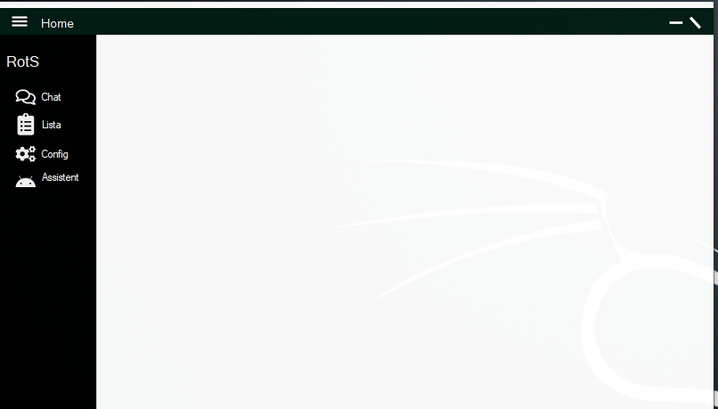
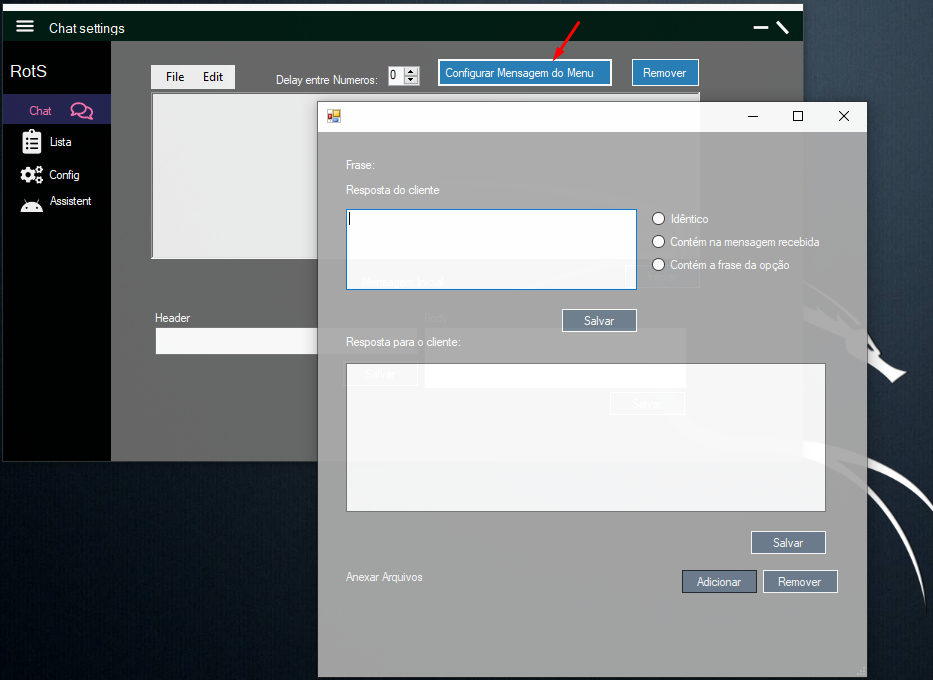
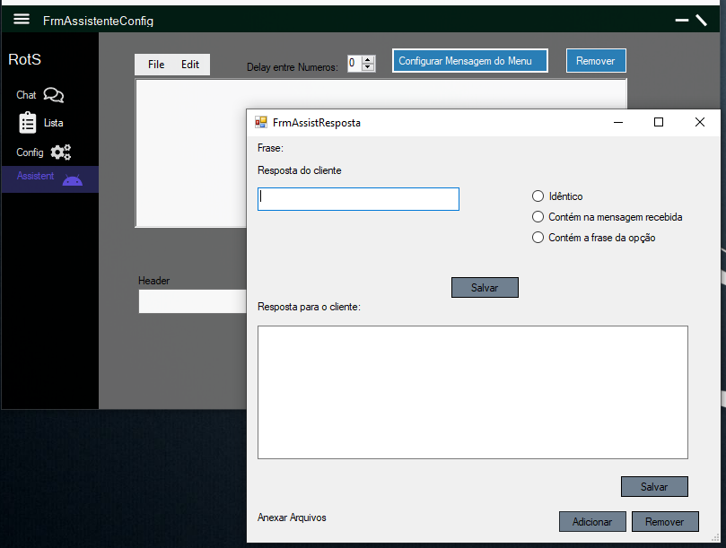
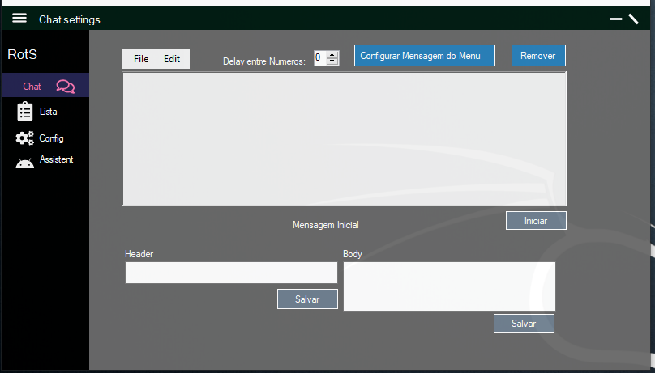
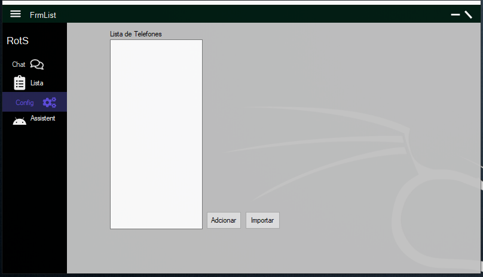

# Sistema de disparo de mensagens automatizado

> Sistema de disparo de mensagens utilizando a API do WhatsApp, com assistente de respostas pré definadas. 
Possui
Cadastro de textos a ser enviado, configuração de respostas, de acordo com a conversa, filtro de insultos, etc.

## Telas do Sistema

Tela inicial
 

 Assitente
 

 Configuração de Assistente virtual
 

 Configuração dos textos de resposta
 

 Configuração dos textos
 

 Lista de telefones
 

## Meta

Ivair Marcelo – [@ivairmarc] – ivairwork@outlook.com

[https://github.com/ivairmarc/]

